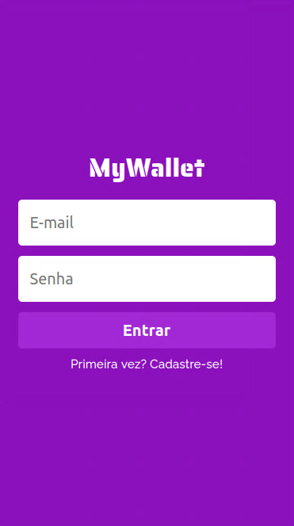

# 
# MyWallet - Financial management control Web App
### Project developed during week 15, Bootcamp Responde Aí offered by Responde Aí.
## The following tools were used in the construction of the project:
|HTML|CSS|JavaScript|ReactJS|
|-|-|-|-|
|||||
|JSX syntax|CSS styling and styled components|ECMAScript 2015 (ES6) features|React is a JavaScript library for building user interfaces, declarative and component-based|
___
[Click here](https://my-wallet-front-six.vercel.app/) to acess the App
___

