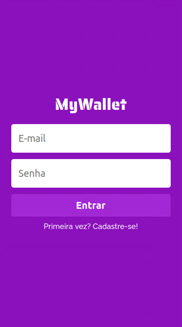

# MyWallet Frontend
### Financial management control Web App.

<p align="center">
  
</p>

<p align="center">
   <a href="https://my-wallet-front-six.vercel.app/">Click here</a> to acess the App
</p>

## About

This is an web application which helps people meet their life goals through the proper management of financial resources. Below are the implemented features:

- Sign Up
- Login
- Deposit
- Withdrawal
- History
- Account balance

[Project repo]

## Technologies

### The following tools and frameworks were used in the construction of the project:
|HTML|CSS|JavaScript|ReactJS|
|-|-|-|-|
|[<p align="center"></p>][html]|[<p align="center"></p>][css]|[<p align="center"></p>][es6]|[<p align="center"></p>][react]|
|JSX syntax|CSS styling and styled components|ECMAScript 2015 (ES6) features|React is a JavaScript library for building user interfaces, declarative and component-based|


[html]: https://www.w3schools.com/html/
[css]: https://www.w3schools.com/css/
[es6]: https://262.ecma-international.org/6.0/
[react]: https://reactjs.org/
[Project repo]: https://github.com/RafaelBahiense/MyWallet


## How to run

1. Clone this repository
2. Clone the [backend repository]
3. Follow instructions [to run the backend]
4. Install dependencies
```bash
npm i
```
5. rename `example.env` -> `.env`
6. Config .env files as indicated
7. Run the Front with
```bash
npm start
```
8. Finally access http://localhost:3000 on your favorite browser

[backend repository]: https://github.com/RafaelBahiense/MyWallet-Back
[to run the backend]: https://github.com/RafaelBahiense/MyWallet-Back#how-to-run
